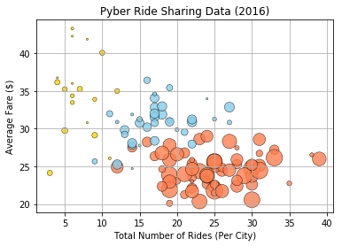
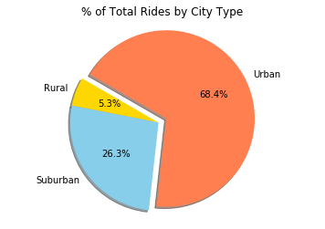

# Python-Matplotlib-Pyber
This program uses the Matplotlib library to analyze trip data for a fictional ridesharing application.

Technologies Used: Python, Pandas, Matplotlib, Jupyter Notebook

In this program, city type (either urban, suburban, or rural) is analyzed as an independent variable, several trip attributes are evaluated as potential dependent variables, and the units of analysis include trips, drivers, and cities. The program organizes and plots trip data using the [Pandas](https://pandas.pydata.org/) and [Matplotlib](https://matplotlib.org/index.html) libraries. The program is built using a [Jupyter](https://jupyter.org/) notebook.

Analysis of the program's output yields a few key findings. First, trips taken in urban cities account for the majority of trips, along with the majority of drivers and fare revenues. Second, fares tend to be lowest in urban cities and highest in rural cities. Third, there appears to be a negative correlation between the average fare in a given city and the total number of rides taken in that city. Included below are a few of the program's graphic outputs:

/

